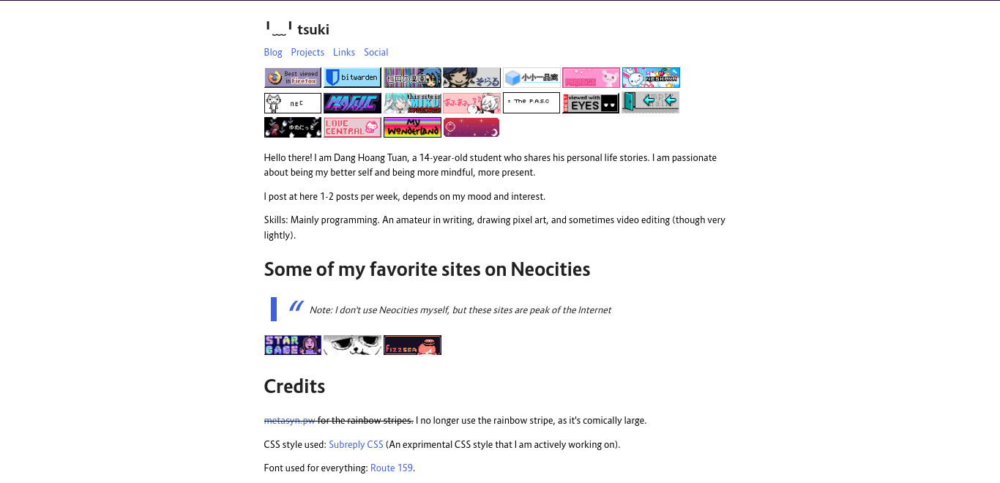
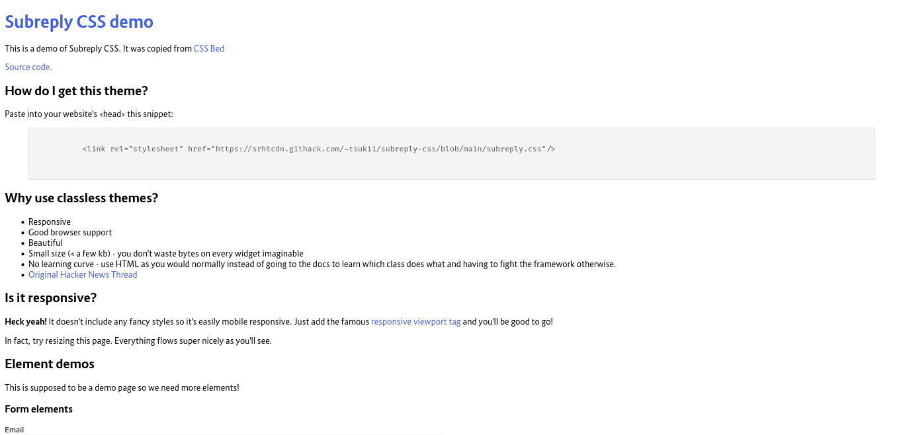

# Subreply CSS [](https://twitter.com/intent/tweet?text=Subreply+CSS+is+a+simple+yet+modern+and+beautiful+classless+CSS+style&url=https://github.com/HoangTuan110/subreply-css&via=DangHoangTuan20&hashtags=bootstrap,css,classless,subreply)


<a href="https://www.producthunt.com/posts/subreply-css?utm_source=badge-featured&utm_medium=badge&utm_souce=badge-subreply&#0045;css" target="_blank"></a>
[](https://forthebadge.com)


Subreply CSS is a simple, yet modern and beautiful classless CSS style. It's
suitable for both personal blogs and as a bootstrap. It was influenced by the
clean social media [Subreply](https://subreply.com/about). (Hence the name)

* **Lightweight** - Only weights 4 kB! (original version)
* **Mobile responsive** and **image responsive**
* **Automatic dark/light theme** (based on OS preferences)
* **Custom emojis** before `mailto:`, `sms:`, and `tel:` links
* **Custom blockquotes** and **code blocks**
* Beautiful font ([Route 159](https://dotcolon.net/font/route159/))
* Fixing missing features from the original Subreply, such as **radios and checkboxes**

Wanna try it first? Visit the [demo](https://raw.githack.com/HoangTuan110/subreply-css/main/test.html)
or go to [my website](https://tsk.bearblog.dev), which uses Subreply CSS.

# Screenshots




# Installation

You can download the file `subreply.css` or `subreply.min.css`, or paste into your website's &lt;head&gt;
this snippet:

```css
<link rel="stylesheet" href="https://cdn.statically.io/gh/HoangTuan110/subreply-css/main/subreply.css">
```

You can also use the minified version in production mode:

```css
<link rel="stylesheet" href="https://cdn.statically.io/gh/HoangTuan110/subreply-css/main/subreply.min.css">
```

# Changelog

## v0.1

Initial release

## v0.2 (29/06/2022)

Changes:

- The `margin: 0; padding: 0;` CSS style has been removed to allow for natural rendering
- Links (`a`) now uses the accent (nice blue) color instead of black to make it unique from texts
- Uses the same style for both `input[type="submit"]` and `button`
- Remove the `float: right;` style on buttons and `input[type="submit"]` elements, as it's annoying when using in paragraphs.
- Add emojis before `mailto:`, `tel:`, and `sms:` links to differentiate them from normal links
- Clean out a bunch of class-based CSS, which is not what we wanted for a classless CSS
- Getting checkboxes to work
- Fixing the problem why the text in checkboxes are under the checkbox
- Removing the hover in `input[type="submit"]` and `button` for good.
- Remove `display: block;` for image to avoid awkward displaying
- Blockquotes now use background colors as the opposite colors of the text colors for readability
- Add minified version of the style

## v0.3 (30/06/2022)

- Removing `line-height` in `body, input, label, select, textarea` tag so that text don't override each other
- Fixing the width of `input` so that they aren't comically long
- Making images responsive (Stolen from [Sakura](https://oxal.org/projects/sakura/))

## v0.4 (01/07/2022)

- Reduce the size of images so that they doesn't look too big, but are still easily visible
- Making the --regular size look bigger so it doesn't look so tiny on desktop

# Copyright and credits

Copyright 2022-present [Dang Hoang Tuan](https://tsk.bearblog.dev).

Original code by [Lucian Marin](https://github.com/lucianmarin).

This CSS style is under the MIT license.
